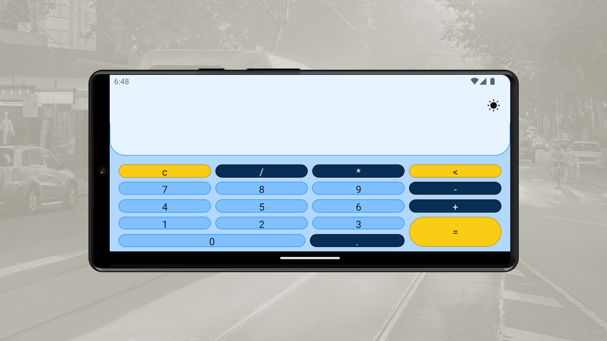

<h1 align="center">
Calculator App With Jetpack Compose, Kotlin, Material 3, JUnit, Mockito, Dagger 2, Coroutines, Ui Automator 2
</h1>

 

 

  <a href="#description">✍️ Description</a> &nbsp;&nbsp;&nbsp;|&nbsp;&nbsp;&nbsp <a href="#technologies">🚀 Technologies</a> &nbsp;&nbsp;&nbsp;|&nbsp;&nbsp;&nbsp <a href="#related">♟️ Related</a> &nbsp;&nbsp;&nbsp;|&nbsp;&nbsp;&nbsp <a href="#contact">✉️ Contact</a>

 
 

<h3 id="description">✍️ Description:</h3>

This Project is built using all the android modern ui development approach (the declarative approach) and laying onto hexagonal architecture, that delivers a scalable and extensible with a good maintainability. Using the Ui Automartor 2 give to the testing environment a reliable end-to-end testing suit to test anything beside compose ui development - for example activities and integrations.

 

<h3 id="technologies">🚀 Technologies:</h3>

To build this project is used:

- Native Android (Java API)
- Jetpack Compose
- JUnit
- Compose Testing library
- Exp4j
- Composition Local
- Local Api
- Mockito
- Dagger 2
- Android Hilt
- Data Store
- Gradle (Kotlin DSL)
- View Model
- Live Data
- Compose State
- Material 3 (Material You)
- Ui Automator 2

 

<h3 id="related">♟️ Related:</h3>

See more:

<ul>
  <li><a href="https://github.com/samuelcarvalhodeveloper/Pokedex-With-Next-Js-Typescript-Axios-Jest-React-Testing-Library-PHP-Laravel-Python-Django">Web Pokedex</a></li>
  <li><a href="https://github.com/samueldecarvalhodeveloper/Calculator-With-Next-Js-Nginx-Load-Balancer-Proxy-Server-Server-Side-Rendering-Typescript-Sass">Web Calculator</a></li>
  <li><a href="https://github.com/samuelcarvalhodeveloper/Notes-App-With-React-Native-Expo-Custom-Hooks-Typescript-Sqlite3-Prettier-Eslint-EditorConfig-Jest">Notes App With React Native</a></li>
</ul>

 

<h3 id="contact">✉️ Contact:</h3>

**Email:**
<a href="mailto:personal.samuelcarvalho@gmail.com">personal.samuelcarvalho@gmail.com</a>

 
 

<strong>Repository Link:</strong>

[https://github.com/samueldecarvalhodeveloper/Calculator-App-With-Jetpack-Compose-Kotlin-Material-3-JUnit-Mockito-Dagger-2-Coroutines-Ui-Automator](https://github.com/samueldecarvalhodeveloper/Calculator-App-With-Jetpack-Compose-Kotlin-Material-3-JUnit-Mockito-Dagger-2-Coroutines-Ui-Automator)
